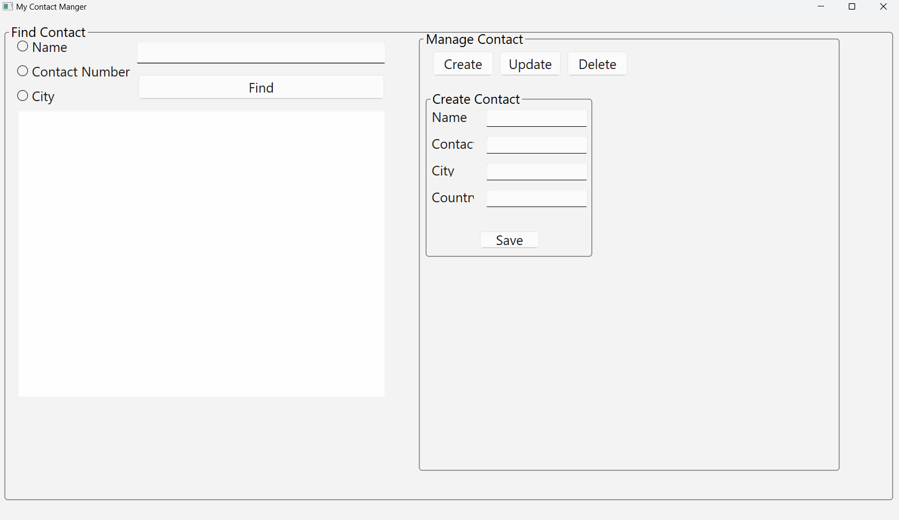

# Contact Manager

A simple yet effective **Contact Manager** application built using **Qt/C++ framework** and **SQLite3**. This project demonstrates how to create a modular, GUI-based contact management system that can be easily adapted for other organizations or personal use.

---

## Features

- **Graphical User Interface**: Built using Qt/XML, offering an intuitive and user-friendly experience.
- **Backend Logic**: Developed in C++ for efficient performance and modularity.
- **Database Integration**: Uses SQLite3 for storing and managing contact details.
- **Modular Design**: The code is well-structured and can be customized easily to suit different applications.

---

## Prerequisites

To build and run this project, ensure you have the following installed:

1. **Qt Framework** (e.g., Qt Creator or Qt Designer)
2. **C++ Compiler**
3. **SQLite3**

---

## Setup Instructions

### Clone or Download the Repository:

```bash
git clone https://github.com/ChaosKingNV/Contact-Manager.git
cd Contact-Manager
```
---
# Configure Database
1. Move the `contacts.db` file (provided in the project directory) to your desired path.
2. Update the database path in the source code:

    ```cpp
    QString dbPath = "/path/to/your/contacts.db";
    ```

# Open Project in Qt Creator
1. Open the `.pro` file in Qt Creator.
2. Configure the build environment.

# Build and Run
1. Build the project.
2. Run the application to manage your contacts.

# Learning Outcomes
By working on this project, you will:

- Gain hands-on experience with the Qt/C++ framework.
- Learn how to integrate SQLite3 for database operations.
- Understand how to design and implement modular code for GUI applications.
- Build a foundation for developing advanced software projects.

# User Interface Preview
The application interface is shown below:




